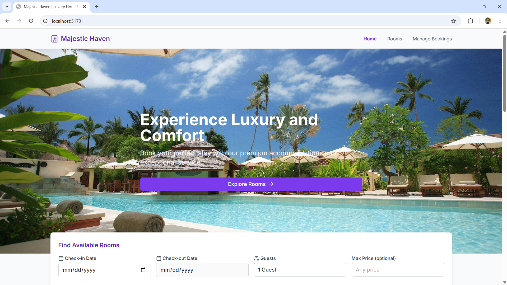
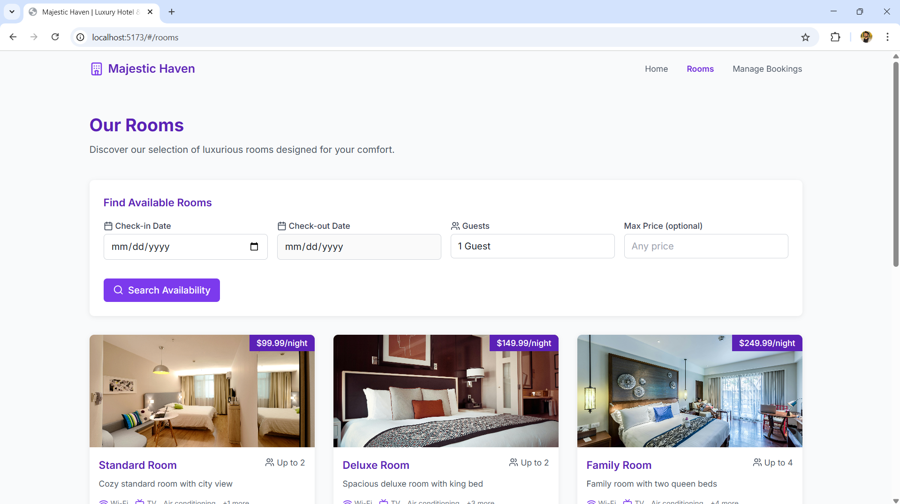
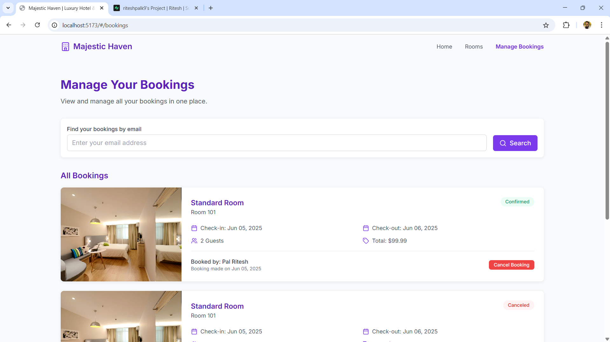

# 🏨 Hotel Booking System

A modern, responsive hotel booking web application built with React, TypeScript, Tailwind CSS, and Supabase. It allows users to browse available rooms, view details, make bookings, and manage their reservations easily.

## 🚀 Features

* 🏠 **Home Page** – Modern landing page with CTA
* 🍯 **Room Listings** – Browse all available rooms with filters
* 🔍 **Room Details** – View detailed information and images for each room
* 🗓️ **Booking Flow** – Intuitive form to select dates, guests, and complete a booking
* ✅ **Booking Confirmation** – Confirmation screen with unique booking ID
* 📋 **Booking Management** – View and manage all previous bookings
* 🔭 **Routing** – Fully client-side routing with React Router
* 🌐 **Responsive Design** – Mobile-first, works on all screen sizes
* ☁️ **Backend** – Powered by Supabase (PostgreSQL + API)

---

## 🛠️ Technologies Used

* **Frontend**

  * React (w/ Hooks & Functional Components)
  * TypeScript
  * Tailwind CSS
  * React Router
  * React Hot Toast

* **Backend**

  * Supabase (Database, Auth, API)

* **Tooling**

  * Vite (Development & Build)
  * Prettier & ESLint (Formatting & Linting)

---

## 📸 Screenshots 

### 🎥 Demo Video  
(https://www.youtube.com/watch?v=rbB2xSyTLPs)

### 🖼️ Screenshots  
  
  



---

## 📦 Folder Structure

```
/src
  ├── components/     # Reusable UI components
  ├── lib/     # Reusable UI components
  ├── pages/            # Page components (Home, RoomList, Booking, etc.)
  ├── services/         # API calls & integration with Supabase
  ├── supabase/            # Helper functions (if any)
  ├──....
```

---

## 🧪 Local Setup & Development

### 1. **Clone the repository**

```bash
git clone https://github.com/your-username/hotel-booking-system.git
cd hotel-booking-system
```

### 2. **Install dependencies**

```bash
npm install
```

### 3. **Configure Supabase**

* Create a project on [Supabase](https://supabase.io/)
* Copy your `SUPABASE_URL` and `SUPABASE_ANON_KEY`
* Create a `.env` file in the root:

```env
VITE_SUPABASE_URL=your_supabase_url
VITE_SUPABASE_ANON_KEY=your_supabase_anon_key
```

### 4. **Run the development server**

```bash
npm run dev
```

The site will be available at: [http://localhost:5173](http://localhost:5173)

---

## 🚢 Build for Production

```bash
npm run build
```

Then preview with:

```bash
npm run preview
```

---

## 🧠 Deployment Options

* **Vercel / Netlify** (Recommended)
* Ensure that the following fallback setting is used to support React Router:

  * `historyApiFallback: true` in `vite.config.ts`

---

## 📟 License

This project is open-source and available under the [MIT License](LICENSE).

---

## 🙌 Acknowledgements

* [Supabase](https://supabase.io/)
* [React](https://react.dev/)
* [Tailwind CSS](https://tailwindcss.com/)
* [Lucide Icons](https://lucide.dev/)
